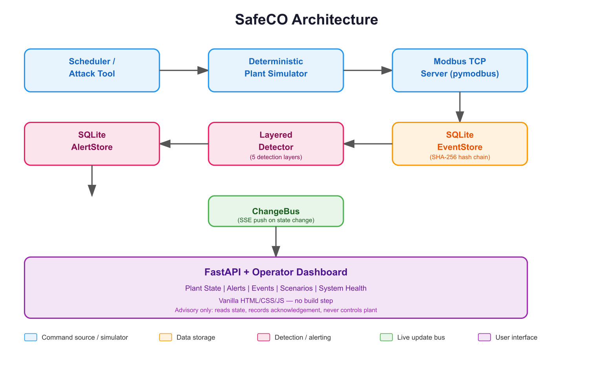
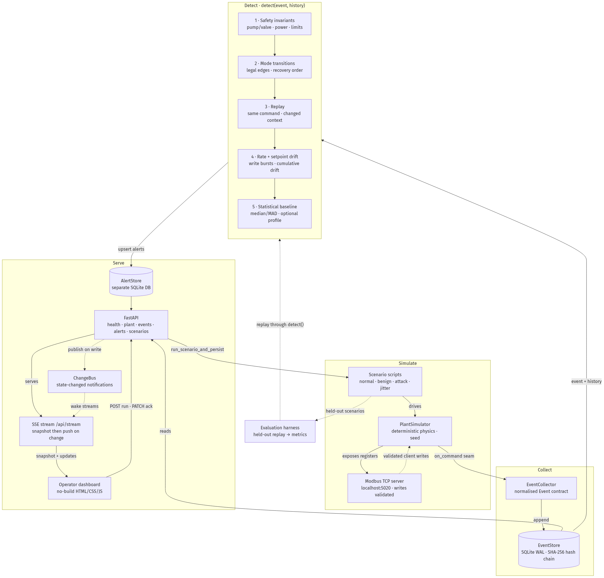

<p align="center">
  
</p>

<p align="center">
  <a href="#"></a>
  <a href="#"></a>
  <a href="#"></a>
  <a href="#"></a>
  <a href="#"></a>
  
</p>

<p align="center"><strong>Detect → Explain → Recommend → Human Decides</strong></p>

---

## What is SafeCO?

SafeCO is a local-first, advisory cybersecurity monitor designed for industrial control systems (ICS). It detects commands that are **protocol-valid but unsafe** in the current process context — the kind of commands that Modbus, DNP3, or OPC-UA would happily deliver, but that could cause real harm depending on what the plant is doing right now.

Built for the ICSC 2026 hackathon, SafeCO monitors **Adupe Municipal Water Station**, a fictional municipal water facility, through a deterministic Modbus TCP simulator.

### Key Principles

- **Never autonomously blocks**: SafeCO detects, explains, and recommends. A human always decides.
- **Process-aware**: Evaluates commands against real-time plant state, not just protocol syntax.
- **Tamper-evident**: Event records form a SHA-256 hash chain for audit integrity.
- **Reproducible**: Seeds, generator versions, and evaluation splits ensure deterministic results.

## What SafeCO Detects

| Attack Type | Description |
|---|---|
| **Injection** | Commands injected outside normal scheduler flow |
| **Replay** | Valid commands replayed after plant context has changed |
| **Mistimed** | Commands valid in one mode but issued in another (e.g., startup command during normal operation) |
| **Setpoint Drift** | Gradual accumulation of small setpoint changes exceeding safety thresholds |
| **Statistical Baseline** | Anomalous telemetry patterns detected via robust median/MAD baseline |

SafeCO also correctly **accepts** normal startup, shutdown, maintenance, recovery, and demand scenarios without false positives.

## How It Works

<p align="center">
  
</p>

The detector applies five sequential layers:

1. **Process safety invariants** — Checks against physical limits (e.g., tank overflow, pump while valve closed)
2. **Operating-mode transitions** — Validates commands against current plant mode (startup, normal, shutdown, maintenance, recovery)
3. **Replay detection** — Identifies valid commands replayed after context changes
4. **Command-rate and setpoint-drift** — Monitors cumulative changes over time
5. **Statistical baseline** — Robust median/MAD anomaly detection on telemetry features

<p align="center">
  
</p>

Full end-to-end flow, including the layers above: [`docs/flowchart.md`](docs/flowchart.md).

## Quick Start

```bash
# Clone and setup
git clone https://github.com/BTA-NG/SafeCO.git
cd SafeCO
python -m venv .venv
. .venv/bin/activate
pip install -r requirements.txt -r requirements-dev.txt

# Run the dashboard
PYTHONPATH=src python -m uvicorn safeco.app:app --host 127.0.0.1 --port 8000
```

Open [http://127.0.0.1:8000](http://127.0.0.1:8000) in your browser.

## Dashboard Features

| Panel | Description |
|---|---|
| **Plant State** | Live operating mode, power source, pump/valve status, tank level, target, and safety limits |
| **Alerts** | Detector findings with severity, confidence, evidence, and engineer acknowledgement |
| **Events** | Persisted command history with SHA-256 hash chain verification |
| **Scenarios** | Run deterministic simulation scenarios with configurable seeds |
| **System Health** | Feed freshness, database status, and event count |

## Recommended Demo Flow

Use seed `42` throughout for reproducibility:

1. **Empty state** — Show degraded visibility with no events
2. **`startup_01`** — Normal startup accepted, no alerts
3. **`attack_injection_01`** — HIGH unsafe-pump-start alert with evidence
4. **`attack_replay_01`** — Replay detection after context change
5. **Acknowledge alert** — Show record-only acknowledgement
6. **`benign_noise_01`** — Telemetry noise accepted without attack alert
7. **Stale feed** — Degraded visibility with last-known state

## CLI Tools

```bash
# Run a scenario and print its fingerprint
PYTHONPATH=src python -m safeco.scenarios startup_01 --seed 42 --fingerprint

# Run detector evaluation
PYTHONPATH=src python -m safeco.evaluation

# Evaluation options
PYTHONPATH=src python -m safeco.evaluation --held-out
PYTHONPATH=src python -m safeco.evaluation --without-baseline
PYTHONPATH=src python -m safeco.evaluation --compare
PYTHONPATH=src python -m safeco.evaluation --samples-json
```

## API Reference

| Method | Endpoint | Description |
|---|---|---|
| `GET` | `/api/health` | Feed freshness, visibility, database status |
| `GET` | `/api/plant/state` | Latest persisted process snapshot |
| `GET` | `/api/events` | Recent events (filterable by `scenario_id`) |
| `GET` | `/api/events/{event_id}` | Single event details |
| `GET` | `/api/alerts` | Detector alerts (filterable by acknowledgement) |
| `PATCH` | `/api/alerts/{alert_id}/ack` | Record engineer acknowledgement |
| `GET` | `/api/scenarios` | List runnable scenarios |
| `POST` | `/api/scenarios/{scenario_id}/run` | Execute seeded scenario |

Interactive API documentation: [http://127.0.0.1:8000/docs](http://127.0.0.1:8000/docs)

## Verification

Run all checks before committing:

```bash
.venv/bin/ruff check src tests
.venv/bin/ruff format --check src tests
PYTHONPATH=src .venv/bin/python -m pytest -q
git diff --check
```

## Safety Boundaries

- **Fictional facility**: Adupe Municipal Water Station is a representative demo, not a real plant
- **No real data**: All evaluation results are synthetic and scenario-based
- **Advisory only**: SafeCO never autonomously blocks, reverses, or issues plant commands
- **Hash chain**: Detects event modification, not sensor truthfulness
- **Evaluation scope**: Scenario-based testing, not production safety certification

## Repository Structure

```
src/safeco/
├── app.py              # FastAPI application entry point
├── simulator.py        # Deterministic water-process simulator
├── scenarios.py        # Normal, benign, and attack scenarios
├── modbus_server.py    # Localhost Modbus TCP adapter
├── events.py           # Normalized event contract
├── storage.py          # Persistent event store and hash chain
├── detector.py         # Layered detection engine
├── baseline.py         # Robust statistical baseline
├── evaluation.py       # Scenario evaluation and metrics
└── api/static/         # No-build HTML/CSS/JS dashboard
```

## Contributing

Read `context.md`, `architecture.md`, and `docs/plant_contract.md` before modifying shared interfaces. Engineering standards and Git workflow rules are in `AGENTS.md` and `CONTRIBUTING.md`.

---

<p align="center">
  <sub>Built for ICSC 2026 Hackathon — Challenge E: Critical Infrastructure & Energy</sub>
</p>
