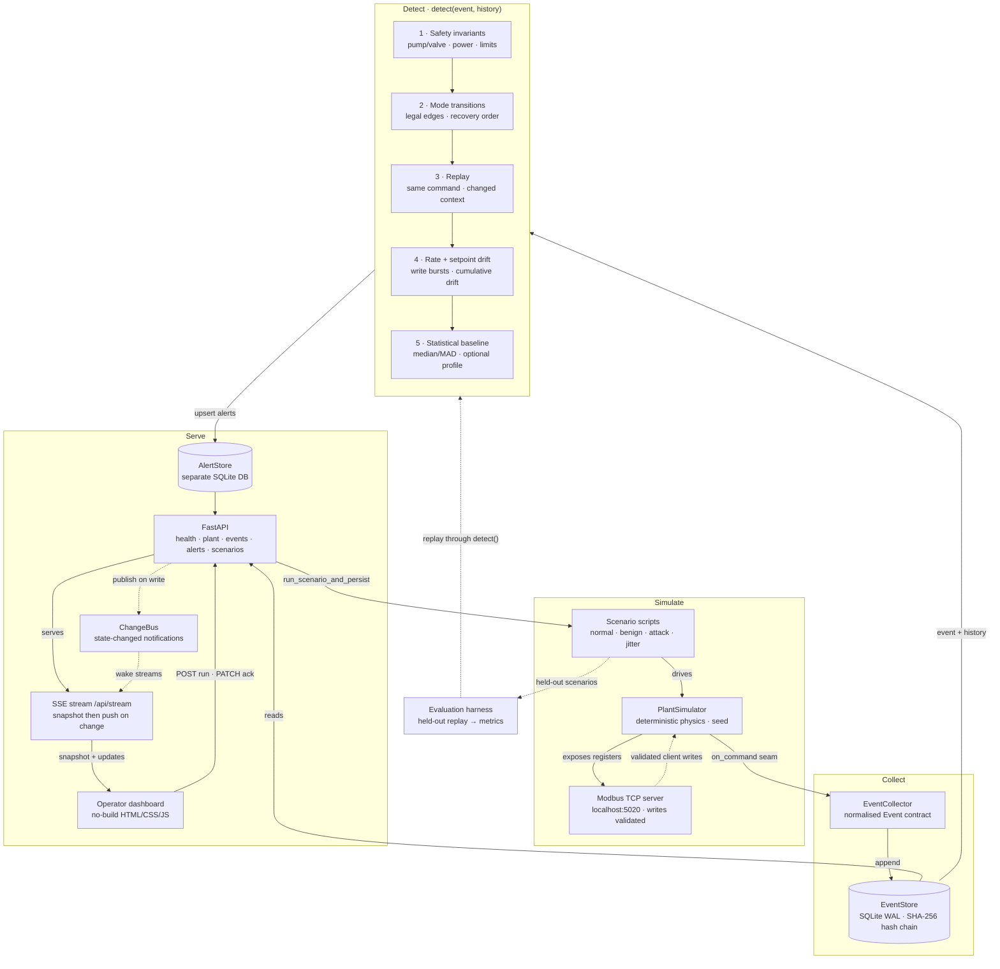

# SafeCO End-to-End Flow

Detailed data and control flow, from scenario scripts through detection to the
operator dashboard. For the high-level overview, see `docs/architecture.png`
(embedded in the README's "How It Works" section).


Solid arrows are data flow; dotted arrows are control signals and
secondary/offline paths. SafeCO stays advisory throughout: nothing in this
chart blocks, reverses, or issues a plant command — the detector only
describes what it observed, and a human decides.

## Source



## Re-rendering

`flowchart.png` is rendered from the Mermaid block above via
[kroki.io](https://kroki.io) (mermaid-cli also works but needs a local
Chrome for Puppeteer). To regenerate:

```bash
# 1. Extract the fenced Mermaid block to /tmp/flowchart.mmd
.venv/bin/python -c "
import pathlib, re
text = pathlib.Path('docs/flowchart.md').read_text()
m = re.search(r'\`\`\`mermaid\n(.*?)\n\`\`\`', text, re.DOTALL)
pathlib.Path('/tmp/flowchart.mmd').write_text(m.group(1) + '\n')
"
# 2. Render through Kroki (diagram is zlib-compressed + base64url-encoded)
.venv/bin/python -c "
import base64, pathlib, zlib
src = pathlib.Path('/tmp/flowchart.mmd').read_text()
enc = base64.urlsafe_b64encode(zlib.compress(src.encode(), 9)).decode()
pathlib.Path('/tmp/kroki_url.txt').write_text(f'https://kroki.io/mermaid/png/{enc}')
"
curl -S --max-time 120 -o docs/flowchart.png "$(cat /tmp/kroki_url.txt)"
```
