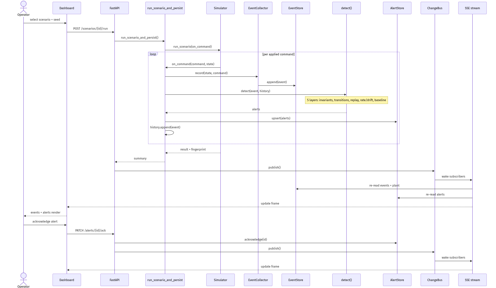
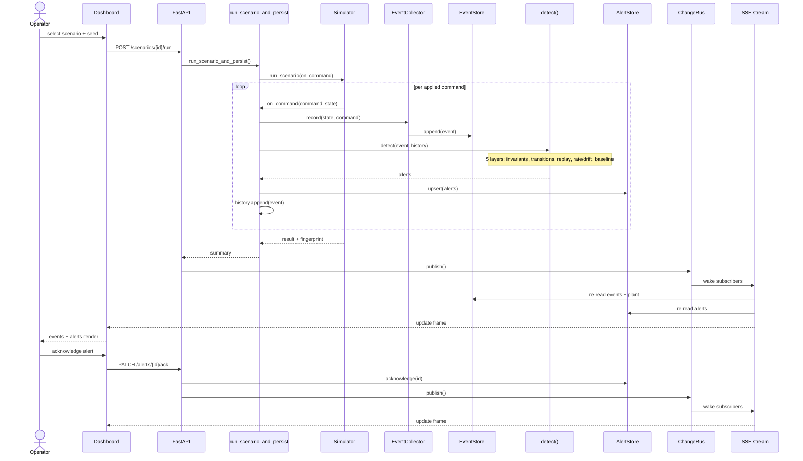

# SafeCO Scenario-Run Sequence

Ordered runtime walkthrough of a single scenario run through detection to the
operator dashboard, plus the acknowledgement return path. For the static
system overview, see `docs/architecture.png`; for the full data-flow graph,
see [`docs/flowchart.md`](flowchart.md).



SafeCO stays advisory throughout: nothing here blocks, reverses, or issues a
plant command. Detection only describes what it observed; the engineer
acknowledges and decides.

## Source



## Re-rendering

`sequence.png` is rendered from the Mermaid block above via
[kroki.io](https://kroki.io). To regenerate:

```bash
# 1. Extract the fenced Mermaid block to /tmp/sequence.mmd
.venv/bin/python -c "
import pathlib, re
text = pathlib.Path('docs/sequence.md').read_text()
m = re.search(r'\`\`\`mermaid\n(.*?)\n\`\`\`', text, re.DOTALL)
pathlib.Path('/tmp/sequence.mmd').write_text(m.group(1) + '\n')
"
# 2. Render through Kroki (diagram is zlib-compressed + base64url-encoded)
.venv/bin/python -c "
import base64, pathlib, zlib
src = pathlib.Path('/tmp/sequence.mmd').read_text()
enc = base64.urlsafe_b64encode(zlib.compress(src.encode(), 9)).decode()
pathlib.Path('/tmp/kroki_seq_url.txt').write_text(f'https://kroki.io/mermaid/png/{enc}')
"
curl -S --max-time 120 -o docs/sequence.png "$(cat /tmp/kroki_seq_url.txt)"
```
